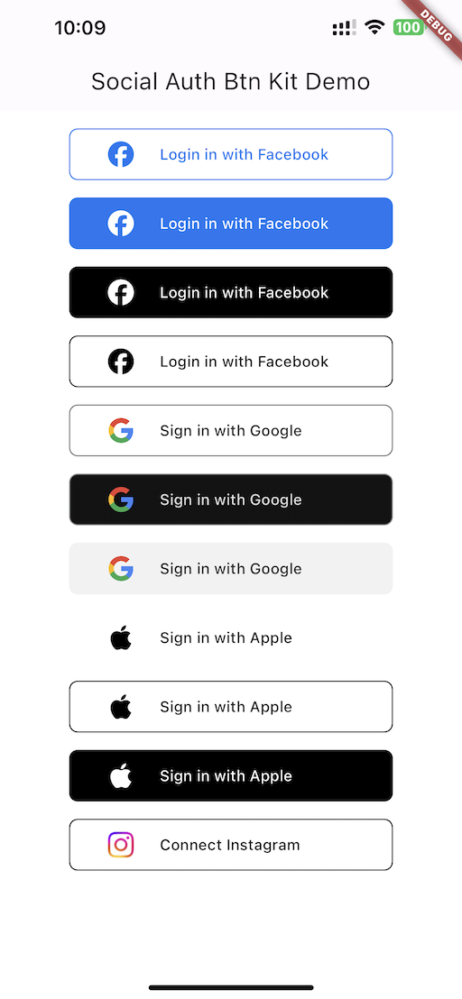

# Social Auth Buttons Kit
Flutter UI Components for adding social sign in buttons in your project following the brand guidlines of each social provider.
Social Sign in is a part of almost every app and this makes it easier to add buttons quickly.



## Supported Provider
- Facebook
- Google
- Apple


## Getting started

To get stated add this as a dependency in your project.
```
flutter pub add social_auth_btn_kit
```

## Usage

### Facebook
Facebook brand guides allow for a normal and outlined button
can be passed as the ```variant``` parameter ```FacebookTypeVariants```
```dart
enum FacebookTypeVariants {
  normal,
  outlined,
}
```
Also the theme variant can be configured using the ```theme``` parameter
```dart
enum FacebookThemeVariants {
  light,
  dark,
}
```

### Google
Google brand guides have three themed buttons can be passed as the ```theme``` parameter ```GoogleThemeVariants```
```dart
enum GoogleThemeVariants {
  light,
  dark,
  neutral,
}
```
### Apple
Apple button support is also added with outline and dark support according to brand


```dart
SocialAuthBtn.facebook(
                variant: FacebookTypeVariants.outlined,
                onPressed: () {
                  debugPrint("DEBUG: Facebook Btn Pressed");
                },
              ),
```

## Custom buttons
You can create your own buttons using these quick styles, just add the icon in your assets folder and call the main constructor with custom values
```dart
SocialAuthBtn(
                onPressed: () {
                  debugPrint("DEBUG: Instagram Btn Pressed");
                },
                icon: 'assets/instagram.png',
                text: 'Connect Instagram',
                borderSide: const BorderSide(),
              ),
```

